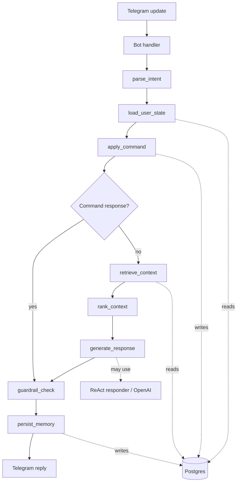
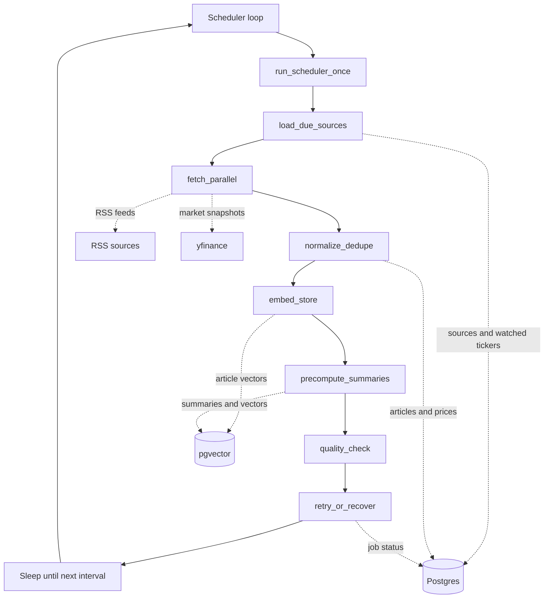

# News Agent

Telegram chatbot for configurable world, local, and stock-focused news. The first version uses
Python, LangGraph, Postgres, pgvector, RSS feeds, market data adapters, and lightweight technical
analysis.

## Stack

- Python 3.11+
- `python-telegram-bot`
- LangGraph for chat and scheduler workflows
- Postgres with pgvector for durable memory and semantic retrieval
- SQLAlchemy + Alembic
- RSS ingestion with `feedparser`
- Market data via `yfinance` for the MVP
- Technical indicators via `pandas`

## Architecture

The app has two LangGraph workflows: one for interactive Telegram messages and one for scheduled
news refresh jobs.

### Agent Graph



The agent graph classifies commands and natural-language messages, loads user preferences and
memory, retrieves relevant news and market context, builds a response, applies financial guardrails,
and persists short-term or long-term memory.

### Scheduler Graph



The scheduler graph keeps the retrieval store fresh by loading enabled sources and watched tickers,
fetching external data, deduplicating articles, storing market snapshots, embedding new content,
precomputing summaries, and recording job completion status.

## Setup

```bash
cp .env.example .env
docker compose up -d
pip install -e ".[dev]"
alembic upgrade head
news-agent
```

Set `TELEGRAM_BOT_TOKEN` before starting the bot.

## Commands

- `/start` initializes defaults.
- `/brief` returns world, local, markets, and watched-stock highlights.
- `/stocks` returns watched ticker movement and basic technical-analysis context.
- `/watch AAPL TSLA` adds watched tickers.
- `/unwatch TSLA` removes watched tickers.
- `/topics ai economy china` updates topic preferences.
- `/local Waterloo` updates local-news focus.
- `/addsource <rss-url>` adds a source.
- `/sources` lists enabled sources.
- `/memory` shows saved preferences and learned memory.
- `/forget <item>` removes a memory item.
- `/resetmemory` clears learned memory.

## Safety

Stock output is informational only. The bot should summarize price movement, news context, and
technical indicators, but must not provide buy/sell recommendations.
